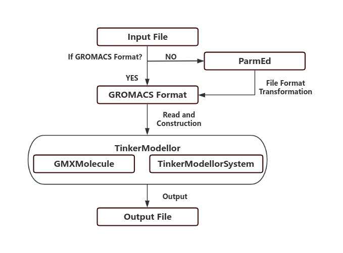

# Summary

TinkerModellor (TKM) serves as a versatile biological system construction tool designed to create intricate virtual biological systems for molecular dynamics within the Tinker Simulation Program. Its primary function involves the input generation of complex systems compatible with molecular simulation software. TKM possesses the capability to convert various specific formats, such as crd/top in Amber, gro/top in GROMACS, and crd/psf in CHARMM, into the Tinker format (Tinker XYZ). Moreover, TKM offers a user-friendly and concise approach, functioning as an independent script for convenient usability. Additionally, it provides users with several distinct modules to construct personalized workflows, ensuring flexibility and ease of use. Essentially, TKM empowers users to model or simulate within one software and seamlessly transition to Tinker for analysis or further simulation, effectively harnessing separate functionalities concurrently.

# Statement of need

Molecular dynamic simulation technology employs advanced computational algorithms to replicate the dynamic behavior of biomolecules or materials at the atomic and molecular scale. This virtual laboratory enables researchers to observe and analyze the intricate interactions and movements of individual atoms, shedding light on phenomena such as protein folding, chemical reactions, and molecular motion in different environments. Particularly, this technology finds extensive application in computer-aided drug design (CADD) [@Welborn:2022], enzyme rational design[@Zheng:2022], and ab initio antibody design[@Chowdhury:2018]. Notably, vibrational Stark effect spectroscopy experiments[@Fried:2017] have demonstrated the existence of electric fields (EF) that potentially play a crucial role in drug and enzyme design[@Bhowmick:2017;@Chaturvedi:2023;@Li:2021;@Welborn:2023]. However, investigating EF necessitates a high-precision polarization force field to accurately model the dynamic response of electrons to external forces and capture the nuanced effects on molecular structures and interactions. According to the best of our knowledge, AMOEBA/AMEOBAPro[@Bim:2021;@Ren:2011;@Shi:2013] stands as a pioneering force field in this domain, effectively integrated into the Tinker simulation program. Furthermore, a post-analysis tool for EF has been proposed[@Nash:2020], enabling seamless analysis of trajectory files generated by Tinker. Consequently, utilizing Tinker for EF research emerges as a promising method.

Despite its utility, Tinker has limitations in modeling and simulation processes. It faces challenges in building systems with over 10,000 residues and struggles with accurate topology structure identification. Imperfect parallel computing and the inability to harness GPU acceleration technology act as bottlenecks for Tinker-8. Conversely, GROMACS, Amber, and CHARMM boast robust modules for constructing intricate systems. Additionally, all three support GPU acceleration, potentially enhancing simulation tasks. Aligning the formats of these software with the Tinker format can assist users in creating customized files seamlessly. Furthermore, it integrates Tinker's specialized EF analysis capabilities into these traditional software, potentially expediting drug and enzyme design processes and related endeavors.

# Workflow

TinkerModellor primarily comprises two distinct parts: the GMXMolecule Module, the TinkerModellorSystem Module. Notably, TinkerModellor primarily operates based on the GROMACS format input file. While this might present some limitations, we've mitigated this challenge by leveraging ParmEd, a powerful tool capable of converting between GROMACS, Amber, and CHARMM format files seamlessly. Consequently, users of Amber and CHARMM can also utilize TinkerModellor, as we've successfully integrated ParmEd into its functionalities

{ width=100% }
Figure 1. Schematic diagram of TinkerModellor workflow.

The GMXMolecule class is specifically crafted to retain topological details for each molecule type, encompassing bonding relationships and atom types in GROMACS format, among other specifics. Throughout subsequent processes, if a molecule appears multiple times, its topology information will be utilized accordingly, significantly reducing memory usage during system construction. Moreover, the TinkerModellorSystem is devised to encompass the entirety of information requested by Tinker for the system. Essentially, it functions as a data storage class, housing atom types and bonding relationships. However, it also encompasses distinct elements, such as atom indices and coordinates for each atom. These unique details, absent in GMXMolecule, require extraction from coordinate files and subsequent integration with topology information.

The TinkerModellor module necessitates input of both a coordination file and a topology file. It proceeds by invoking functions to read and partition the topology file into distinct molecule types, creating a GMXMolecule object for each type. For instance, a system comprising a protein, a ligand, water, and ions would prompt TinkerModellor to generate GMXMolecule objects for each corresponding molecule type: protein, ligand, water, and ions. Moreover, the end of the topology file denotes the number of appearance time for each molecule type. TinkerModellor utilizes this information to amalgamate the coordinate file with topology relationships within the GMXMolecule. Subsequently, the topological relationship between coordinates and GMXMolecule is amalgamated and stored in the TinkerModellorSystem object. It's worth noting that within this model, atom types from the topology file within GMXMolecule undergo automatic transformation into the AMOEBABIO18[@Corrigan:2021] force field for simulating polarizable force field systems. Ultimately, TinkerModellor compiles the information from the TinkerModellorSystem object into an output file.

# Usage

## Command Line Usage

The general usage of the command is as follows:

python tkm.py -c coordination_file -p topology_file -out output_file [options]

Here is an example of how to use the command:

python tkm.py -c my_coordination_file.gro -p my_topology_file.top -o my_output_file.xyz -f G -a True

This command will run the TinkerModellor with a GROMACS coordination file my_coordination_file.gro and topology file my_topology_file.top, and it will output the result to my_output_file.xyz. The input file format is set to GROMACS, and the aggressive atomtype matching mode is enabled

## Packge Usage

import tinkermodellor as tkm
new= tkm()
new('gromacs.gro',gromacs.top')
new.write_tkmsystem('gromacs.xyz')

{ width=100% }
Figure 2. Protein (PDBID:1AG2) in water box. The system is constructed by GROMACS[@Abraham:2015] and transformed into Tinker format by TinkerModellor. Mapping by visualization software VMD[@Humphrey:1996].

# Future Plan

Enhanced Force Field Support: Expand the available force field options to include AMOEBA9[@Ren:2011] for protein-ligand simulations, AMOEBANUC17[@Zhang:2018] for protein-DNA/RNA simulations, and AMOEBAPRO13[@Shi:2013] for more precise biological system simulations. This extension of force field selections will cater to diverse simulation needs across various biological contexts.

Trajectory Transformation: Implementing trajectory adaptation from GROMACS, Amber, and CHARMM to convert their trajectories into Tinker's format will enable simulations across different software platforms. This adaptation allows leveraging the computational efficiency of established biomechanical simulation software like GROMACS, while harnessing Tinker's unique analytical functionalities. This approach promotes the synergy between multiple software, enabling each to capitalize on its specific strengths in simulations and analyses.

# Availability
TinkerModellor is freely available under the BSD 3-Clause License on GitHub. For installation instructions, module testing , Python API and tutorial please visit the [GitHub website](https://github.com/WanluLigroupUCSD/TinkerModellor).

# Acknowledgements

We acknowledge startup funding from the Jacob school of Engineering, UCSD. This work used the computational resources from the Expanse supercomputer at the San Diego Super Computing Center (SDSC), through allocation CHM230035 and CHE230113. We are also grateful for the financial supports of China National Innovation and Entrepreneurship Training Program for Undergraduate (No.202310316093Y)

# Conflict of Interest Statement
The authors declare the absence of any conflicts of interest: No author has any financial, personal, professional, or other relationship that affect our objectivity toward this work.

# References
